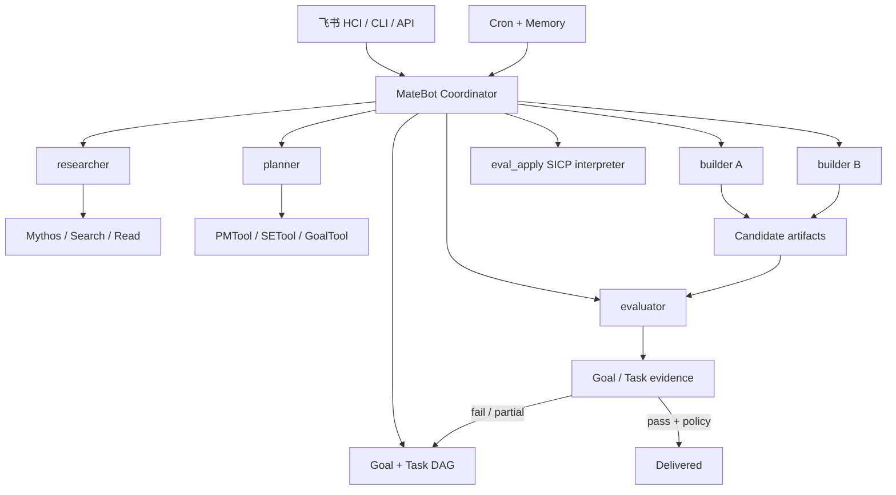

# MateBot 群体智能 Harness

Actor 通信内核、Lisp 元解释器与跨 IP WebSocket 帧见 [matebot-actor-protocol.md](./matebot-actor-protocol.md)。本地不同目录/进程和远程节点共享同一个信封语义；文件 mailbox 与 WebSocket 只是传输适配器。

## 目标

这一层将 OpenCC 从“单个模型带一组工具”收敛为 MateBot 的群体智能执行基座：用户只提供目标，协调者负责任务图、并行路由、状态回收和质量门禁。它借鉴了 Kimi 多智能体资料中的五个生产要素：编排、专门化角色、共享上下文、通信和评估。

参考：<https://www.kimi.com/zh-cn/resources/multi-agent>

## 运行架构



### 控制面

`--matebot` 或 `OPENCC_MATEBOT=1` 启用协调模式。协调者拥有普通 OpenCC 的完整工具集（包括 shell、编辑、Notebook、浏览器、Web、Skill 和 MCP），并额外获得目标、任务、通信、调度和质量门禁能力。主 Agent 根据速度、质量、并行性、专业性和隔离需求自主决定直接完成还是委派 Worker，不通过删除工具强制分工；需要独立验证时再交给 evaluator。用户显式配置的 deny 规则与正常权限策略仍然生效。

### 执行面

| 角色 | 责任 | 主要能力 |
|---|---|---|
| `researcher` | 宽搜索、证据提取、矛盾发现 | Mythos、WebSearch、Read |
| `planner` | 目标分解、DAG、风险和验收标准 | Goal、Task、PMTool、SETool |
| `builder` | 有界实现、局部验证 | Edit、Bash、工程工具 |
| `evaluator` | 独立、对抗式验证 | Read、Bash；禁止项目写入 |
| `worker` | 无合适专家时的通用降级 | 按任务边界分配 |

AgentTool、后台任务、teammate mailbox、工作树隔离和远程 session 继续作为执行 runtime，没有新造第二套 Agent 循环。

## `eval_apply` 元解释器

这里的 eval/apply 指 SICP 求值器的两个核心过程，不是“评审/批准”的缩写。环境按 Actor 地址隔离并在进程内持久：

- `eval` 求值一到多个 Lisp 表达式，并保留 `define` / `set!`；
- `apply` 将环境中的过程、primitive 或 lambda 显式应用到 JSON 参数；
- `bindings` 让 Agent 和用户看到当前顶层 frame；
- `reset` 显式丢弃 frame；
- `self` 可读取当前作用域；`tx` / `rx` 不在解释器内开放，通信必须经过 transcript 可见的 `ActorTool`。解释器也没有 shell 或文件系统后门。

交付质量仍由独立 evaluator、Goal 成功标准和 Task 证据承担；不能把元解释器的一次成功求值当成交付通过。

## MateBot 四个产品维度的映射

| 维度 | 当前 harness |下一层产品接入 |
|---|---|---|
| 空间 | 进程无关的 CLI/print/server、远程 session 基础 | 容器化 worker pool、多租户状态库、飞书 HCI adapter |
| 任务 | 专家路由 + 任务 DAG + Mythos wide research | 跨机队列、负载/成本路由、图可视化 |
| 时间 | 持久 Cron 重进入 + Memory 长期事实 | 事件源触发、小书童助理策略、SLA/静默时段 |
| 质量 | 独立 evaluator + Goal/Task 持久证据 | eval 数据集、回放、线上指标、策略签名 |

## 运行方式

```bash
bun run matebot
OPENCC_MATEBOT=1 bun run dev
opencc --matebot -p "完成这个需求，必须通过独立评估后才 apply"
```

云端调度器应使用 `OPENCC_MATEBOT=1` 而不是修改模型 prompt。这个环境变量会同时打开协调者、Agent Teams 和时间调度能力。

## 当前边界

已完成的是可运行的单进程/远程 session harness 基石，不是完整 MateBot SaaS。飞书 HCI、云端多租户持久化、跨机消息总线、评估数据回放和发布策略签名属于下一层 adapter/control-plane 工作，不应偷塞进 Agent 提示词。
